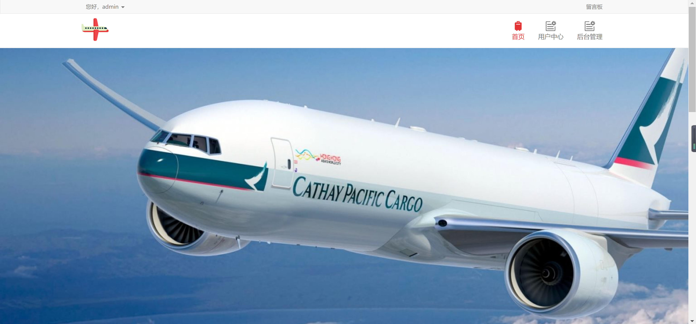
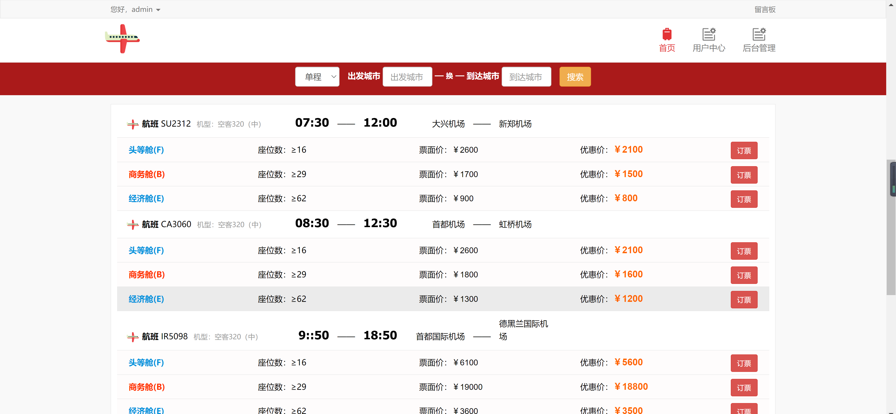
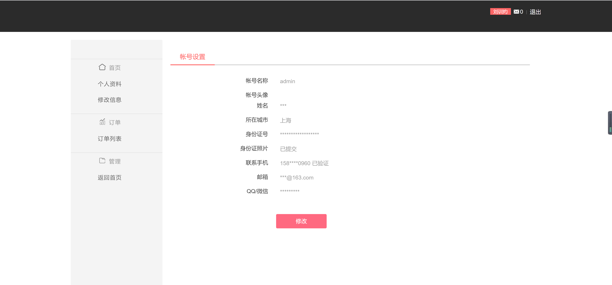
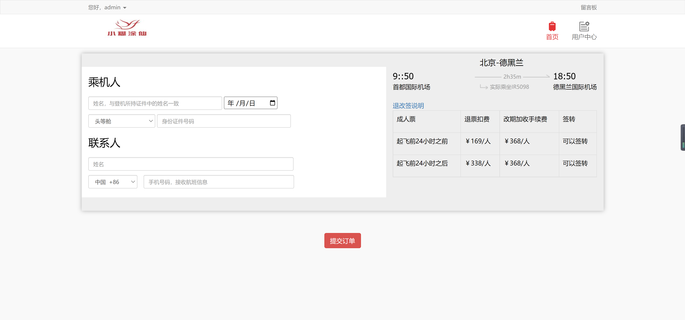
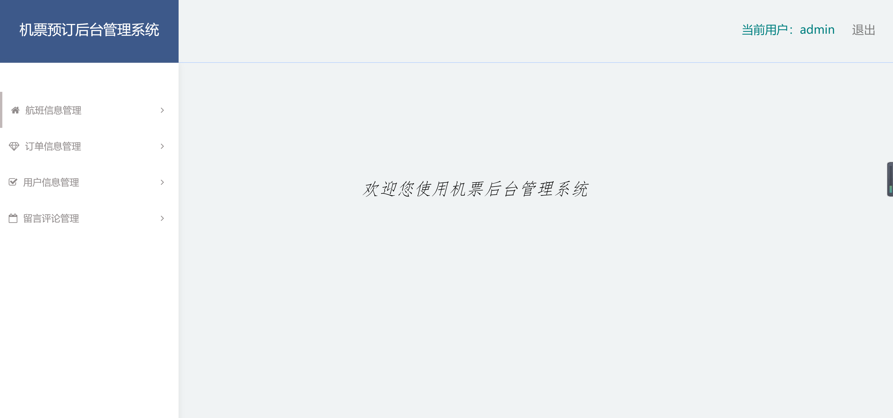
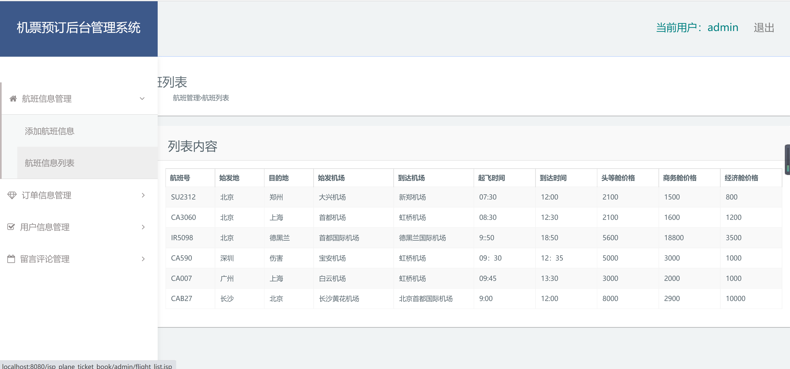

<h1 align="center">机票预订后台管理系统</h1>

## 简介
机票预订后台管理系统：角色分为管理员、用户；功能包括航班信息管理、订单信息管理、用户信息管理、留言评论管理，支持用户信息编辑和系统导航。    --计算机毕业设计源码；毕设源码；java毕业设计源码

## 联系方式

<h3 align="center">获取完整代码与数据库文件 + 微信：deepguan QQ: 86050149 QQ群: 783742310</h3>

<h3 align="center">可帮忙远程部署 包运行成功！提供远程部署、修改代码、设计文档指导、代码讲解等服务！</h3>

## 功能介绍（完整见运行截图）
管理员：主要负责机票预订后台管理系统的操作和维护，包括用户登录、信息设置、航班管理、订单管理及留言评论管理。提供详细的用户信息审核、航班详情编辑、订单追踪等功能。同时，管理员可以通过中央的导航选项管理和修改个人账户设置，保证系统高效运行并更新相关数据。

## 运行截图

本代码来源于网络,仅供学习参考使用!

